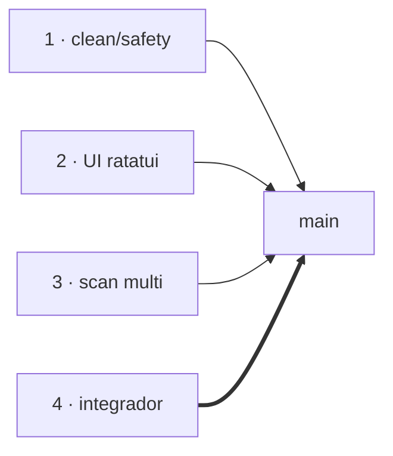

# AGENTS.md — rust-space-cleaner

Guía de coordinación para las **4 sesiones de opencode** que trabajan en este repo.
Léela completa antes de tocar nada: resume **quién es quién, qué hace cada uno
(especialidad + tareas), reglas y estado actual**.

## Las 4 sesiones (especialidades)

| Sesión | Especialidad | Dueño de | Referencia (hecho) | Rama |
|--------|--------------|----------|--------------------|------|
| **1** | **Safety & clean** (`clean.rs`, whitelist) | `clean.rs`, `tests/clean_safety.rs` | `is_safe_to_clean` TDD (10 tests) | `feat/clean` → integrada |
| **2** | **UI/TUI ratatui** (`ui.rs`) | `ui.rs`, interacción teclado | lista de fuentes, spinner, modal y/n | `feat/ui` → integrada |
| **3** | **Scan multiplataforma** (`scan.rs`, fuentes) | `scan.rs`, `tools/gen_fixtures.py`, `.github/workflows/ci.yml`, `tests/scan_extra.rs` | fuentes cargo/journal/docker, CI, 11 tests | `feat/scan-extra` → integrada |
| **4** | **Integrador (esta sesión)** | `model.rs`, `main.rs`, merge, README, backlog | integración de las 3 ramas; B3 (`38c962e`), B1 clean.rs (`5c121e6`) | `main` (canon) |

`main` es la única rama fuente de verdad. Las ramas `feat/*` se borran al integrar.



## Reparto de tareas (quién hace qué AHORA)

### Sesión 1 — Safety & clean
- [x] **B3**: quitar rutas hardcodeadas `/home/mfcode/...` de `tests/clean_safety.rs` y `tests/scan_extra.rs` (rutas multiplataforma / `tempfile`). Hecho: `tests/clean_safety.rs` (`38c962e`); `tests/scan_extra.rs` aún tiene hardcodes.
- [ ] B5 (opcional): detección de duplicados (`dup: Option<String>` + badge `DUP` en TUI).

### Sesión 2 — UI ratatui
- [x] **B4**: barra de progreso por fuente (scan reporta avance por `mpsc`, no solo el resultado final). Rama `feat/progress-tui` → `ScanEvent::Finished{index,source}`, `scan_all_with_progress`, Gauge `x/y` en vivo (32 tests verdes). Pendiente integrar.
- [ ] B5 (opcional): dibujar el badge `DUP` (modelo lo pone otro, tú lo pintas).

### Sesión 3 — Scan multiplataforma
- [ ] **B2**: asegurar que `scan.rs` (journal `/var/log/journal`, docker) quede portado y compile en Windows/macOS; que el claim multiplataforma del README sea verdad.
- [ ] B6 (opcional): `benches/scan.rs` (Criterion) + `tools/gen_fixtures.py --big`.

### Sesión 4 — Integrador (esta sesión)
- [ ] **B1**: traducir todo `src/` a inglés (strings de UI, comentarios, nombres de variables en español de `scan.rs`). Hecho: `clean.rs` (`5c121e6`); el resto en curso.
- [ ] Coordinar merges, correr `cargo test`/`clippy`/`fmt`, pushes a `origin/main`.
- [ ] B7 (opcional): `PKGBUILD` para AUR (→ sesión 3 si toma `benches`).

> Orden recomendado: **B3 y B2 antes de publicar el claim multiplataforma**;
> B1 puede ir en paralelo. Las opcionales (B5-B7) solo cuando sobren ganas.

## 📌 Misión v2 — "Cazador de basura total" (LEER PRIMERO)

Spec completa: `docs/superpowers/specs/2026-08-06-rust-space-cleaner-v2-design.md`.
Hacemos la herramienta **destacada**: ~24 fuentes vía **registry declarativo**
y **TUI espectacular** (tabs, filtros, sort, multi-selección, historial,
progreso). Toda fuente vive en el registry = la whitelist; nada fuera de él se
borra. Detalles de UI, fuentes y errores: en la spec.

### Reparto v2 (reemplaza al backlog tras integrarse)

| Sesión | Qué hace ahora |
|--------|----------------|
| **3** | Motor de fuentes: `registry.rs` (cada fuente = fila + test), ampliar `gen_fixtures.py` (árbol games/web). **NO tocar el mpsc de progreso en `scan.rs`** (lo hace S2) |
| **2** | TUI completa: lista, historial `h`, detalle `enter`, ayuda `?`, atajos, **barra de progreso mpsc** (B4 adentro) |
| **1** | `clean.rs` por lote (`clean_batch`) + whitelist + `state.rs` persistente + confirmación de riesgo `!!` + tests |
| **4** (esta) | `model.rs` + `registry.rs` core (`SourceDef`/`Category`/`Risk`), integración, README/marketing/release/AUR, benchs, merge final |

Compatibilidades del v2: fuentes nuevas/categorías/riesgo entran SIEMPRE por
`registry.rs` (el núcleo lo larga la sesión 4 primero). Convive con la v1
(29 tests actuales, en inglés ya).

## Reglas de convivencia (IMPORTANTE)

1. **Worktree propio obligatorio** si sales de `main`:
   ```bash
   git worktree add /tmp/rsc-<tuyo> -b feat/<lo-que-sea>
   ```
   Si trabajas sobre `main`, avisa al integrador (sesión 4) antes de commitear
   para evitar pisadas como el primer día.
2. **No toques el código del otro**: si tu tarea toca `model.rs` o `main.rs`,
   coordina con el integrador.
3. **Nunca commites fixtures ni target**: `tests/fixtures/` y `target/` están en
   `.gitignore`; se regeneran con `tools/gen_fixtures.py --generate`.
4. **No hagas push a `main`** sin aviso de la sesión 4.

## Convenciones de código

- **Idioma**: TODO en inglés (nombres, comentarios, strings de UI, README,
  commits). Pendiente: restos de español en `src/` (tarea B1).
- **Stack**: Rust + ratatui. Obligatorio antes de decir "listo":
  `cargo test`, `cargo clippy --all-targets -- -D warnings`, `cargo fmt --check`.
- **TDD**: toda funcionalidad con su test.

## Estado actual (commit de referencia: `5c121e6`)

- [x] Tipos: `CleanSource`, `ScanStatus`, `human_size` (`model.rs`)
- [x] Scan multiproceso + fuentes Linux/macOS (Windows ¿ver B2)
- [x] `is_safe_to_clean` whitelist (TDD) + tests con rutas portable (`tempdir`)
- [x] TUI ratatui con dry-run (tecla `d`), spinner, modal, clean.log
- [x] Fixtures + CI (GitHub Actions)
- [x] README en inglés con badges, social-card, blog post
- [x] 29 tests verdes (8 bin + 10 clean_safety + 11 scan_extra)
- [ ] B1 en curso: `clean.rs` traducido; `main.rs`/`model.rs`/`ui.rs`/`scan.rs`/`tests/scan_extra.rs` con traducción en el working tree (otro agente)

## Comandos de referencia

```bash
cargo run                        # TUI (necesita TTY real)
cargo test                       # 29 tests
cargo clippy --all-targets -- -D warnings
cargo fmt --check
python3 tools/gen_fixtures.py --generate   # regenerar fixtures de test
```

*Actualiza este archivo cuando cambie el estado (integra tareas, marca lo hecho).*