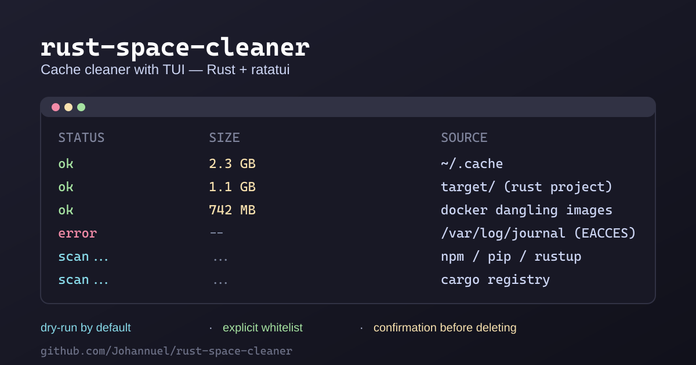

# 🧹 rust-space-cleaner

[](https://github.com/Johannuel/rust-space-cleaner/actions)
[](https://www.rust-lang.org)
[](LICENSE)



A caching cleanup tool for Arch/Linux with a **terminal TUI** (Rust + [ratatui](https://github.com/ratatui/ratatui)). It scans well-known cache sources (package caches, Rust builds, Docker leftovers and system logs), shows you how much each one takes up, and lets you clean them **safely**: it only removes folders from an explicit whitelist and always asks for confirmation.

> [!IMPORTANT]
> The default mode is **dry-run**: nothing is deleted unless you confirm it. The tool only cleans "cache"-type folders on its whitelist -- it never touches user files or `$HOME`.

## Who is it for?

- **Arch/Linux users** whose SSD keeps filling up and who no longer want to guess where the gigabytes went.
- People who use **Docker** with dangling images and **Rust** with accumulated `target/` folders.
- Anyone learning Rust who wants a real, safe TUI as a reference.

## How it works

1. **Scan** (`scan.rs`): detects known sources and measures their size in bytes (multithreaded, without following symlinks).
2. **TUI view** (`ui.rs`): a list sorted by size, showing per-row status (`scan | ok | error | not found`), a spinner while scanning, and a confirmation modal.
3. **Safe cleanup** (`clean.rs`): `is_safe_to_clean(path, whitelist)` decides whether a folder may be removed (exact whitelist entry or direct subfolder of `~/.cache`). Everything else is rejected.

## Sources scanned

| Source | Path | Notes |
|---|---|---|
| User cache | `~/.cache/*` | direct subfolders only, never all of `~/.cache` |
| Cargo registry | `~/.cargo/registry` | |
| Cargo `target/` | your project `target` folders | only if it contains `build/` or `.fingerprint/` |
| Rustup tmp | `~/.rustup/tmp` | |
| npm / pnpm | `~/.npm/_cacache`, `~/.cache/pnpm` | |
| pip | `~/.cache/pip` | |
| systemd journal | `/var/log/journal` | needs sudo; permission errors don't crash the app |
| Docker | dangling images | via `docker images --filter dangling=true` |

## Install

```bash
cargo run --release
```

## Usage

| Key | Action |
|-----|--------|
| `↑` / `↓` or `j` / `k` | navigate between sources |
| `s` | prepare cleanup for the selected row |
| `y` / `n` | confirm / cancel in the modal |
| `d` | toggle dry-run on/off |
| `r` | re-scan |
| `q` / `Esc` | quit |

When dry-run is **off** and you confirm a cleanup, the removal is written to `~/.local/share/rust-space-cleaner/clean.log` (timestamp, size and path of each entry).

## Safety

- **Dry-run by default**: the TUI warns that nothing is removed without confirmation.
- **Whitelist**: only explicit cache paths (or direct `~/.cache` subfolders) can be removed.
- **Hard rules**: `$HOME`, `/`, a whole container folder (e.g. `~/.cache` itself), fake prefixes (`~/.cargo_evil`) and paths outside the whitelist are always rejected -- and tested.

## Tests

```bash
cargo test                 # unit + integration + binary tests
cargo clippy --all-targets -- -D warnings   # strict lints
cargo fmt --check
```

Integration tests use a deterministic fake tree regenerated by `tools/gen_fixtures.py` (gitignored):

```bash
python3 tools/gen_fixtures.py --generate   # recreate tests/fixtures
python3 tools/gen_fixtures.py --clean      # remove it
```

CI (`.github/workflows/ci.yml`) runs `fmt`, `clippy` and `test` on every push and PR.

## Structure

```
src/
  main.rs    -> ratatui startup + real provider (scan + clean)
  model.rs   -> CleanSource, ScanStatus, human_size
  scan.rs    -> source detection + size measuring (threads)
  clean.rs   -> is_safe_to_clean (whitelist) - TDD
  ui.rs      -> list, spinner, confirmation modal
tests/
  clean_safety.rs   # whitelist safety
  scan_extra.rs     # scanning against simulated fixtures
tools/
  gen_fixtures.py   # generate/clean the test tree
```

## Roadmap

- [ ] Live dry-run toggle (`d` key) -- done
- [x] Real deletion with confirmation + activity log (`clean.log`)
- [ ] Optional docker prune support
- [ ] Configurable whitelist/routes via a config file